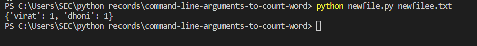

# command-line-arguments-to-count-word
## AIM:
To write a python program for getting the word count from the contents of a file using command line arguments.
## EQUIPEMENT'S REQUIRED: 
PC
Anaconda - Python 3.7
## ALGORITHM: 
### Step 1:
import sys library

### Step 2: 
initialize a variable count={}
 
### Step 3:
open the file using with open(sys.argv[1],'r') as f: 

### Step 4: 
use for loops 

### Step 5: 
use if else for count the words

### Step 6: 
end the program

## PROGRAM:
NAME: Soundariyan M N

Register no: 22008347

```python
import sys
fp=open(sys.argv[1],"r")
d={}
for i in fp:
    for w in i.split():
        if w not in d.keys():
            d[w]=1
         else:
            d[w]+=1

print(d)
```               


### OUTPUT:



## RESULT:
Thus the program is written to find the word count from the contents of a file using command line arguments.
